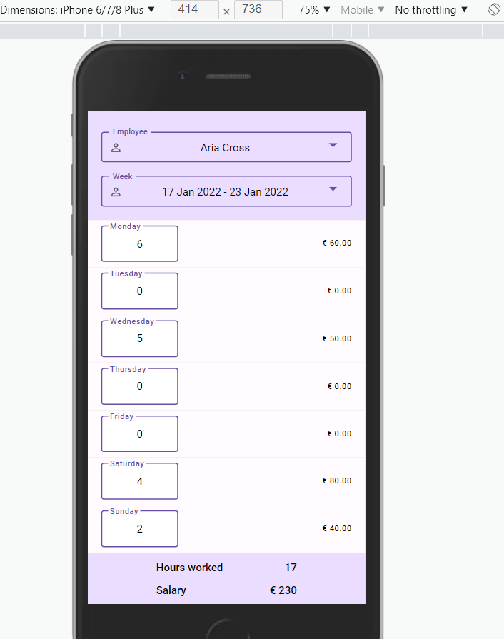
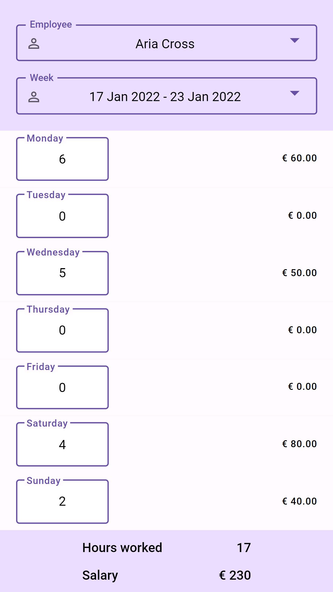

# Timesheet

---

##Visit

You cN try it out: https://timesheet-egija-sp.netlify.app/

### Information about this project:

- React TypeScript single page application

[//]: # ()

The task is to implement the UI of simple timesheet entries for different employees and weeks. Users can select a timesheet filtered by an employee name and a week, and edit hours worked for selected employee and week.

You are free to choose javascript or typescript, any libraries (vue, react, angular, etc) to build the single page application. Mobile-only website, no need to build a responsive website. No backend.

Nice to haves:
* strict TypeScript (if using TypeScript)
* code conforms to lint rules

---

Expected functionality:

* generate random timesheets with random employees
* timesheets must be generated for the current week and previous 4 weeks
* update "Hours worked" instantly
* delay update of monetary values by 0.25-1sec by faking REST API call and display a progress indicator in the meantime. The assumption is the backend (REST API) calculates monetary values.
* for all employees set random hourly rate the weekdays and double hourly rate for the weekend hours

Example.

The hourly rate is €10 and overtime €20, and the employee worked 8 hours on Monday and 4 hours on Sunday:
hours worked is calculated as "12 = 8+4"
salary is calculated as "160 = (8 * 10) + (4 * 20)"

## Available Scripts

## Install

    npm install

## Running the project

    npm run start

Open [http://localhost:3000](http://localhost:3000) to view it in the browser.

